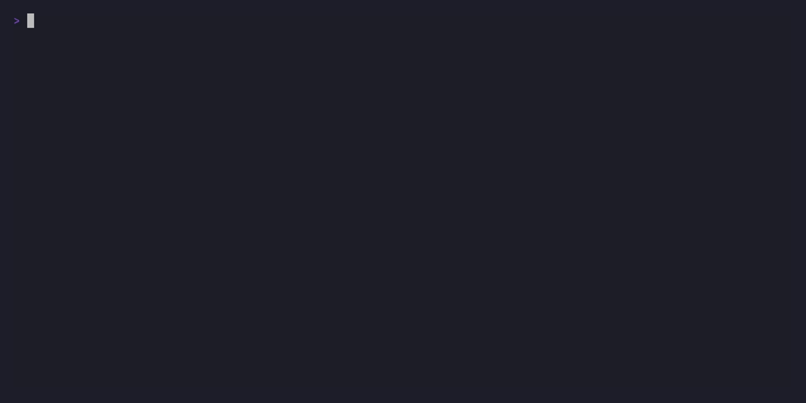

# GoHide VPN Client 🛡️

A fast, terminal-based (TUI) VPN client built with Go and Bubble Tea, powered by the robust `sing-box` engine. GoHide allows you to easily manage your VLESS configurations, switch between routing modes, and check server latencies directly from your terminal.

## 🎥 Demo

**First Launch & Adding a Subscription Link:**


**Server Selection, Ping & TUN Mode:**


**If Subscription Already Exist::**


## ✨ Features

- **Sing-box Core:** Uses the powerful and lightweight `sing-box` engine under the hood.
- **Subscription Folders:** Easily organize and store multiple connection profiles inside a local JSON storage.
- **VLESS Support:** Automatically decodes and parses VLESS subscription links.
- **Dual Routing Modes:** Seamlessly switch between **Proxy** mode and global **TUN** mode.
- **Built-in Ping:** Test server latency directly from the interface before connecting.
- **Cross-Platform:** Fully supported on both Windows and Linux.
- **Clipboard Support:** Easily paste your long subscription URLs using `Ctrl+V` or native terminal paste commands without manual typing.

## 🗺️ Roadmap

- [ ]**Hysteria 2 Support:** Planning to integrate the Hysteria 2 protocol.
- [ ]**Log File Support:** Planning to add a logger.
- [x]**Multiple Subscriptions:** Support for managing and aggregating multiple Subscription URLs.
- [x]**New Login:** Rewrite start page.
- [ ]**Press "R":** Add "Refresh subscriptions" button.

## 🚀 Installation

The easiest way to install GoHide is to download the pre-compiled binary for your operating system.

1. Go to the [Releases](../../releases) page.
2. Download the appropriate binary:
   - **Windows:** `gohide.exe`
   - **Linux:** `gohide`
3. Place the executable in a convenient folder and run it.

## 💡 Usage

Launch the executable from your terminal.

On the first run, you will see an empty subscription explorer. Press `a` to open the addition form, type a custom folder title, and paste your VLESS subscription link. All profiles are stored safely on your machine inside a local `subs.json` file.

### Controls

**On Subscriptions Screen:**

- `↑` / `↓`: Move selection indicator between subscription folders
- `Enter` / `→`: Expand folder and dive into the nested servers list
- `a`: Open the form to add a new subscription profile
- `x`: Delete the currently highlighted subscription folder
- `q` or `Ctrl+C`: Quit the application

**On Servers Screen:**

- `↑` / `↓`: Navigate the server nodes list
- `Enter` / `Space`: Connect / Disconnect from the selected server
- `t`: Toggle between **Proxy** and **TUN** mode for the upcoming connection
- `→` / `l`: Ping the currently highlighted server node
- `p`: Ping all servers within the active folder
- `Esc` / `←`: Go back up to the primary subscription folders panel

### ⚠️ Important Note on TUN Mode

TUN mode creates a virtual network interface to route all your system traffic through the VPN. This requires elevated privileges:

- **Windows:** You must run your terminal (or the executable) as **Administrator**.
- **Linux:** You must run the executable with root privileges (`sudo ./gohide`).

## 🛠️ Building from Source

If you prefer to build the project yourself, you will need [Go](https://go.dev/) installed.

1. Clone the repository:
   ```bash
   git clone [https://github.com/KochetkovAlEX/gohide.git](https://github.com/KochetkovAlEX/gohide.git)
   cd gohide
   ```
2. Preparing:
   Install `sing-box v1.13.9` for linux or windows and upload the file to `internal/bin` folder.  

3. Building

- For windows:
  `go build -ldflags="-s -w" -o gohide.exe ./cmd/gohide`

- For Linux:
  `GOOS=linux GOARCH=amd64 go build -ldflags="-s -w" -o gohide ./cmd/gohide`

